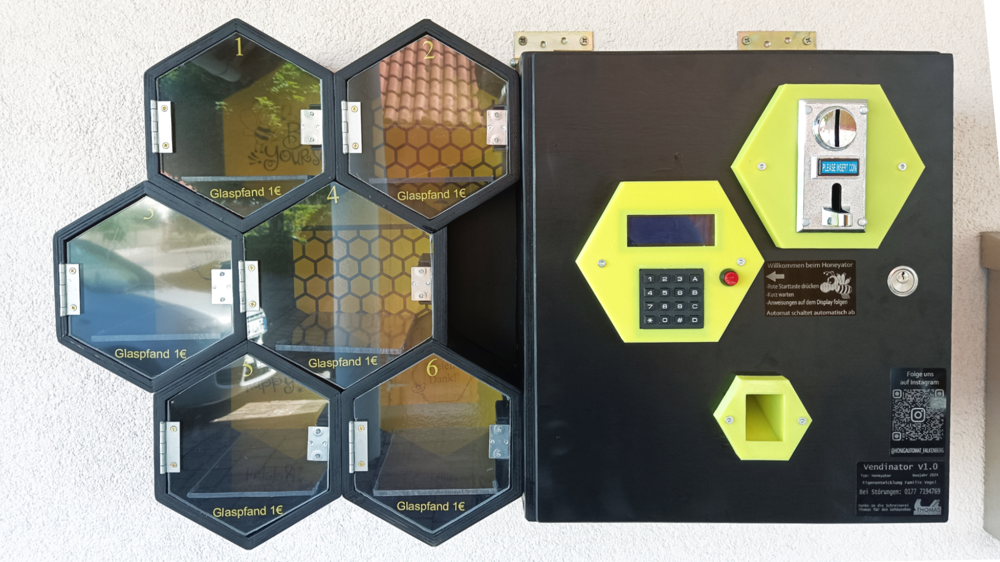

Maker Media GmbH

***

# Verkaufsautomat mit ESP

### Eigene Waren zu vertreiben, kann ganz schön aufwendig sein. Mit einem selbst gebauten Automaten geht das ganz einfach. Einmal eingestellt, übernimmt er die Transaktionen und meldet Verkäufe und Fehler ans Smartphone. Man muss sich nur gut überlegen, wie Hard- und Software zusammenspielen sollen. Dann lässt sich sogar im Schlaf Geld verdienen.

Ergänzend zum Artikel in der Make 5/24 findet ihr hier die Sketches, Schaltpläne und Ablaufpläne.

Den vollständigen Artikel kann man in der **[Make-Ausgabe 5/24](https://www.heise.de/select/make/2024/5)** lesen.
